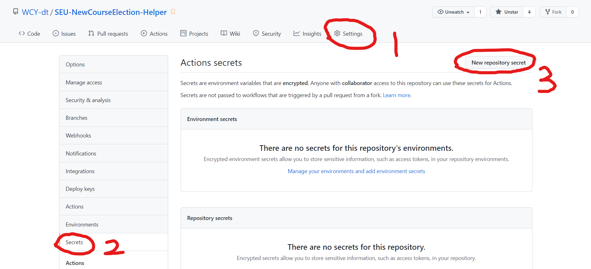
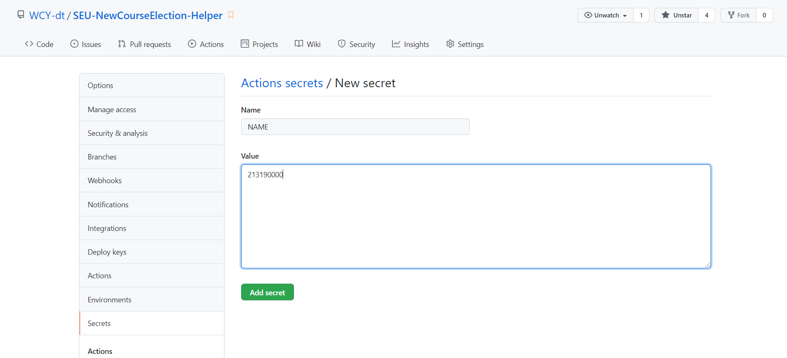
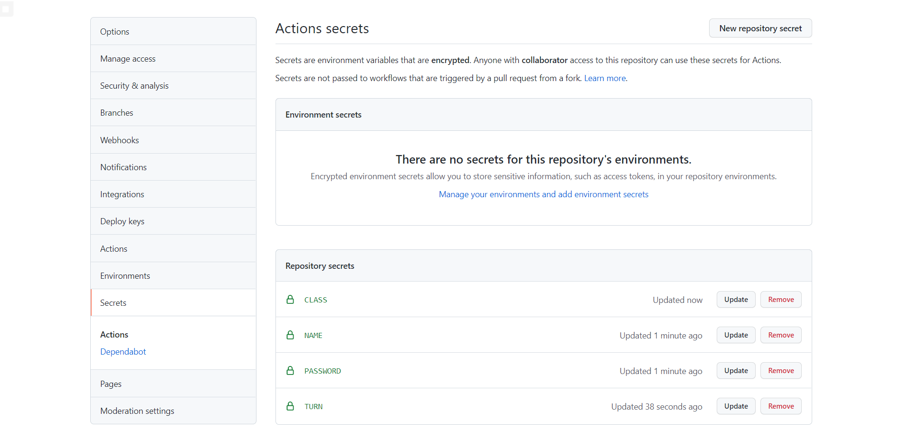

 

     

<h1 align="center" style="text-align:center;">
SEU-NewCourseElection-Helper
</h1>

<h3 align="center" style="text-align:center;">🔊 新增功能：全自动抢课！彻底解放双手！</h3>

脚本共有两个版本

- **在线版**（利用GitHub workflow）
- *离线版已停止开发*

> 离线版由于系统兼容性问题，目前已停止使用与开发。

脚本仍在改进中，可能会有亿点点bug。欢迎提交issues报告问题。

> 因为网络延迟、系统响应速度等问题，目前脚本已降速，大约每分钟刷30次

如果想要改进可以提交pr，脚本的具体技术要点列在readme的最下面。

另外，能不能点个 ⭐star 呀（可怜🥺

## 注意！！！

- 选课系统同时只能有一个设备在线。**脚本运行时请不要再登录你的选课账号**！
- 目前经过尝试，安全的刷课时间为2秒一次！不提供修改手段，但如果你精通python，也**请不要擅自修改**！
- 程序**不会存储任何个人信息**，不放心的尽管查源码！
- 本人对因为程序产生的任何问题**不负责任**！
- 本脚本只能用于捡漏，**请勿用于抢课**！！！
- 请务必**仔细阅读**以下使用方法！！！

## 使用步骤

1. 点击右上角的 fork，把本仓库 fork 走。（如果在这之前能点一个 ⭐star 我会很感激~）
2. 如下图所示，依次点击 `settings`，`secrets`，`new repository secret`按钮

3. 新建四个 `secret`，它们分别是

   - `NAME`：你的账号

   - `PASSWORD`：你的密码

   - `TURN`：选课轮次（如要第三轮就输入`3`）

   - `CLASS`：要选的课程

     例如 `B5710350 [05]` 表示课程编号为 `B5710350`，选择编号为 `05` 的老师。仅有一个老师的也要填。不要忘记了中间的空格！

   例如，下面是填写 `NAME` 字段的一个示例

最终效果如下所示

4. 点击右上角的 ⭐star，即可自动运行。

  > 如果没有自动运行，去 Actions 里面手动点一下运行。

   按照目前设置，如果不出问题，可以一直不停跑下去。如果出现故障，脚本会每隔一小时自检查一次，确保持续不断运行。

## 脚本说明

1. 利用 selenium 模拟选课。由于选课系统只允许同时登录一个设备，所以多线程有点难搞。
2. 验证码识别没有做，因为我不可能在 GitHub 服务器上训练一个模型。我的解决方法是直接输入 0，试到成功为止。据我统计，正常情况 20 次以内就能试出来了。
3. 在线版的脚本没有注释，这是因为一开始放 GitHub 上运行时不停提示我字符集错误，一气之下就把所有中文都删了。但[东南大学选课助手_offline.py](https://github.com/Auroragys/SEU-NewCourseElection-Helper/blob/main/东南大学选课助手_offline.py)是有注释的，可以对照查看。

## star 数目统计

### Stargazers: 

<a href="https://github.com/WCY-dt/SEU-NewCourseElection-Helper/stargazers">

</a>

### Forkers: 

<a href="https://github.com/WCY-dt/SEU-NewCourseElection-Helper/network/members">

</a>

## 贡献者

<a href="https://github.com/WCY-dt">

</a>
